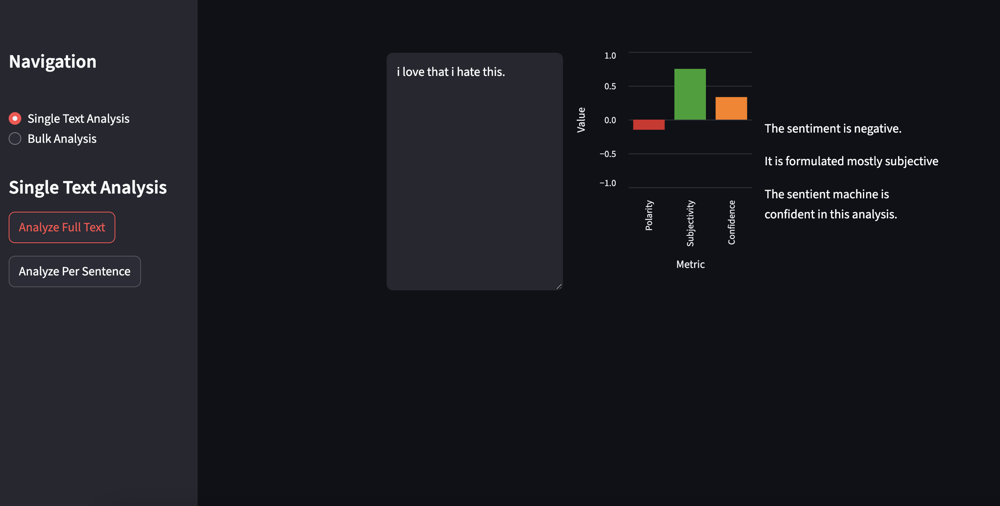
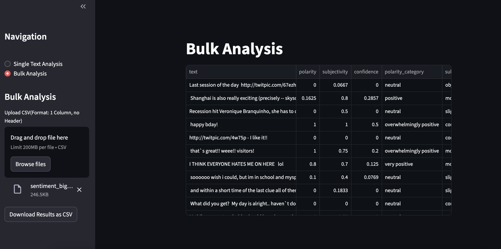

# SentimentAnalysis

A lightweight app for categorizing user comments using NLP, with a Streamlit frontend and FastAPI backend.

## Features

- **Single Text Analysis:** Analyze individual comments for sentiment.
- **Bulk Analysis:** Upload a CSV file (one column, no header) to analyze multiple comments at once.
- **Download Results:** Export sentiment analysis results as CSV.

## Screenshots

**Single Text Analysis UI:**  


**Bulk Analysis UI:**  


## Getting Started

### Running the App

1. **Start the FastAPI backend:**
    ```bash
    uvicorn api_app:app --reload

    or

    fastapi dev api_app.py
    ```
2. **Start the Streamlit frontend:**
    ```bash
    streamlit run app.py
    ```

### Usage

- **Single Text Analysis:**  
  Select "Single Text Analysis" in the sidebar, enter your text, and view the sentiment result.

- **Bulk Analysis:**  
  Select "Bulk Analysis" in the sidebar, upload a CSV file (format: one column, no header), and download the results.

#### Example Test Data

Sample CSVs for bulk analysis are available in the [`test_data/`](test_data/) folder:
- [`sentiment_test.csv`](test_data/sentiment_test.csv)
- [`sentiment_big_test.csv`](test_data/sentiment_big_test.csv)

## API Endpoints

- `POST /analyse` — Analyze a single text.
- `POST /analyse/bulk` — Analyze multiple texts in bulk.

## Project Structure

- `app.py` — Streamlit frontend
- `api_app.py` — FastAPI backend
- `modules/` — UI builders for single and bulk analysis
- `utils/logic.py` — Core sentiment analysis logic
- `test_data/` — Example CSVs for bulk analysis
- `nlp/` — natural language processing model
- `img/` — UI screenshots
